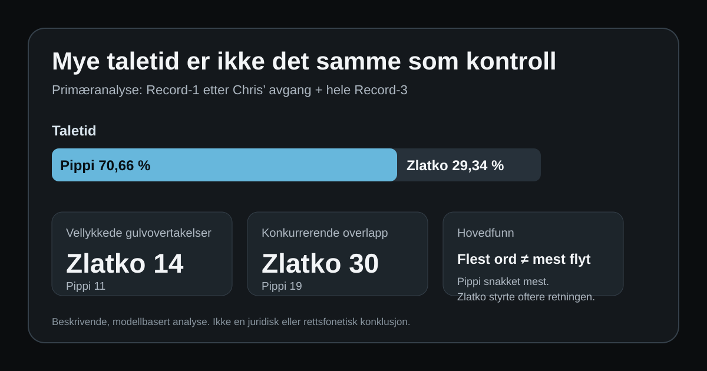

# Når taletid ikke betyr å bli hørt

Dette repoet presenterer en dokumentert samtaleanalyse av to lydopptak med deltakerne **Pippi**, **Zlatko** og innledningsvis **Chris**. Analysen undersøker taletid, talerturer, konkurrerende overlapp, gulvovertakelser og om Pippi fikk gjennomført de skriftlig forberedte fortellingene han ønsket å formidle.

> **Hovedfunn:** Pippi produserte mest språk, men fikk ikke nødvendigvis størst kontroll over samtalens retning. I den sikreste tofaserammen hadde Pippi 70,66 % av taletiden, mens Zlatko oftere startet konkurrerende overlapp og gjennomførte gulvovertakelser. Pippis identifiserte, skriftlig forberedte fortellinger ble ikke fullført.

## Nøkkeltall

| Mål | Pippi | Zlatko |
|---|---:|---:|
| Taletid | 24,67 min | 10,24 min |
| Andel tilskrevet taletid | 70,66 % | 29,34 % |
| Vellykkede gulvovertakelser | 11 | 14 |
| Konkurrerende overlapp | 19 | 30 |
| Avbruddsrate per 10 min egen tale | 4,46 | 13,67 |

Primæranalysen omfatter **Record-1 fra 19:15**, etter at Chris hadde forlatt møtet, samt **hele Record-3**. Denne avgrensningen gjør taleridentifikasjonen mellom Pippi og Zlatko vesentlig sterkere.

## Det sentrale funnet

Pippi foretrekker skriftlig kommunikasjon og hadde forberedt flere tekster. I opptaket forsøker han å:

1. forklare at avbrudd gjør at han mister tråden,
2. vise til tekstene han allerede har skrevet,
3. lese materialet selv,
4. etablere en enkel regel: teksten ferdigstilles før spørsmål og kommentarer.

Likevel blir ingen av de identifiserte fortellingene fullført. Høy taletid kan derfor ikke uten videre tolkes som kommunikativ dominans. En betydelig del av Pippis tale består av omstarter, presiseringer og forsøk på å gjenopprette et avbrutt poeng.

## Dokumenter

- [Full analyse som PDF](report/hele-samtaleanalysen.pdf)
- [Selvstendig HTML-rapport](docs/index.html)
- [Detaljert funnoppsummering](FINDINGS.md)
- [Metode og definisjoner](METHODOLOGY.md)
- [Begrensninger og etiske rammer](LIMITATIONS.md)

## Data

- [`data/talk_time.csv`](data/talk_time.csv): taletid, andeler og talerturer
- [`data/interruptions_primary.csv`](data/interruptions_primary.csv): tidskodede hendelser og klassifikasjon

Rå lyd og full råtranskripsjon er bevisst ikke publisert i repoet.

## Tegneseriestripen

Stripen er en pedagogisk og satirisk visualisering av analysens hovedskille: Man kan snakke lenge og likevel bli stilnet dersom fortellingen aldri får stå ferdig.

## Viktig avgrensning

Dette er en **beskrivende, modellbasert samtaleanalyse**, ikke en rettsfonetisk rapport, medisinsk vurdering eller juridisk avgjørelse. Talermerking, transkripsjon og hendelsesklassifisering har usikkerhet. Påstandene gjelder det analyserte materialet og skal ikke generaliseres til personenes karakter eller intensjon uten ytterligere dokumentasjon.

## Reproduserbarhet

Kildematerialets og sluttproduktenes SHA-256-kontrollsummer er samlet i [`SHA256SUMS.txt`](SHA256SUMS.txt). Definisjonene for avbrudd og gulvovertakelse står i [`METHODOLOGY.md`](METHODOLOGY.md).
